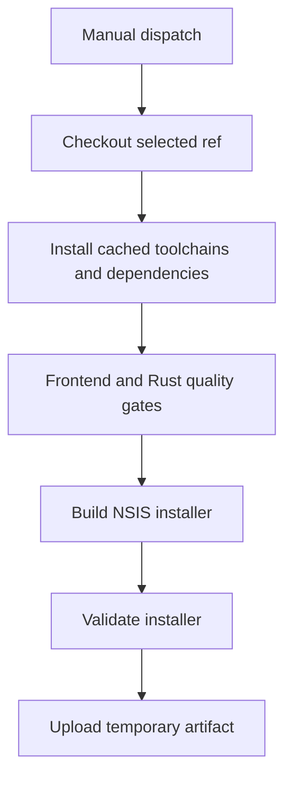

## Workflow Overview

**Purpose**: Produce a downloadable Windows x64 NSIS installer for personal verification before publishing a release.  
**Trigger Events**: Manual dispatch against a selected repository ref.  
**Target Environment**: GitHub-hosted Windows runner.

## Execution Flow Diagram

## Jobs & Dependencies

| Job             | Purpose                                    | Dependencies | Execution context         |
| --------------- | ------------------------------------------ | ------------ | ------------------------- |
| `build-windows` | Validate and package one Windows installer | None         | Windows x64 hosted runner |

## Requirements Matrix

| ID      | Requirement                   | Priority | Acceptance criteria                                           |
| ------- | ----------------------------- | -------- | ------------------------------------------------------------- |
| REQ-001 | Run only by manual request    | High     | No push, pull-request, or tag trigger exists                  |
| REQ-002 | Build the selected ref        | High     | Installer represents the ref selected in the dispatch UI      |
| REQ-003 | Produce one NSIS executable   | High     | Exactly one non-empty `.exe` is uploaded                      |
| REQ-004 | Avoid publishing side effects | High     | No Tag, Release, updater manifest, or repository write occurs |
| REQ-005 | Limit retained storage        | Medium   | Artifact expires after seven days                             |

## Input/Output Contracts

### Inputs

- Selected branch or Tag from the GitHub manual-run interface.

### Outputs

- One directly downloadable Windows NSIS `.exe` artifact.
- Workflow summary containing ref, commit, filename, size, and download link.

### Secrets & Variables

No secrets are required. The verification build disables updater artifacts and does not use the updater signing key.

## Execution Constraints

- Maximum duration: 45 minutes.
- Only one build per ref runs at a time; a newer request replaces an older run for the same ref.
- Repository permission is read-only.
- Installer size must not exceed 100 MiB.

## Error Handling Strategy

| Error                          | Response                            | Recovery                           |
| ------------------------------ | ----------------------------------- | ---------------------------------- |
| Static check failure           | Stop before packaging               | Fix the selected ref and rerun     |
| Build failure                  | Do not upload an artifact           | Inspect build logs and rerun       |
| Missing or multiple installers | Fail validation                     | Inspect Tauri bundle configuration |
| Upload failure                 | Preserve build logs, report failure | Manually rerun the workflow        |

## Quality Gates

- Frontend formatting, lint, and type checks pass.
- Rust formatting and Clippy pass with warnings denied.
- Dependency lockfiles are honored.
- Exactly one installer remains within the size budget.

## Integration Points

| System           | Relationship                                 |
| ---------------- | -------------------------------------------- |
| Vite+            | Installs and validates frontend dependencies |
| Rust             | Compiles and validates the Tauri backend     |
| Tauri            | Produces the NSIS installer                  |
| GitHub Artifacts | Stores the temporary verification executable |

## Compliance & Governance

- Runs remain visible in GitHub Actions history.
- Artifacts expire automatically after seven days.
- The workflow cannot create or modify repository content or Releases.
- Formal signed publishing remains exclusively owned by the Release workflow.

## Validation Criteria

- Manual invocation succeeds for a valid ref.
- The result downloads as a single `.exe` without an archive wrapper.
- Running the workflow does not create a Git Tag or GitHub Release.
- The formal release workflow remains unchanged.
