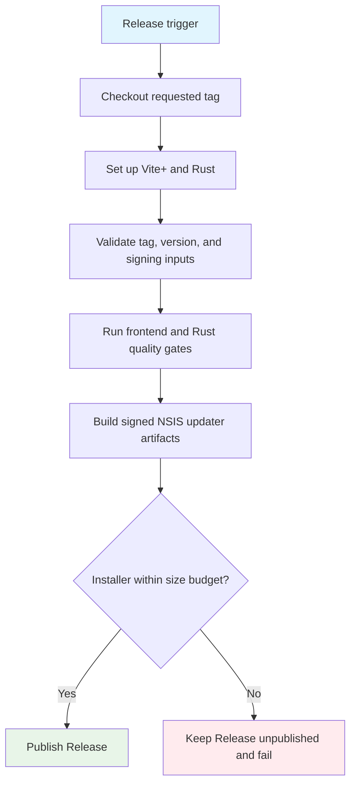

## Workflow Overview

**Purpose**: Validate, sign, build, and publish a stable Windows x64 NSIS release with Tauri updater metadata.
**Trigger Events**: Push of a stable `vX.Y.Z` tag, or manual rebuild of an existing stable tag.
**Target Environments**: Public GitHub Release for Windows x64.

## Execution Flow Diagram



## Jobs & Dependencies

| Job Name        | Purpose                                                    | Dependencies                  | Execution Context            |
| --------------- | ---------------------------------------------------------- | ----------------------------- | ---------------------------- |
| Publish Windows | Validate, build, sign, size-check, and publish the release | Existing tag, signing secrets | GitHub-hosted Windows runner |

## Requirements Matrix

### Functional Requirements

| ID      | Requirement                                    | Priority | Acceptance Criteria                                             |
| ------- | ---------------------------------------------- | -------- | --------------------------------------------------------------- |
| REQ-001 | Accept only stable semantic-version tags       | High     | Tags not matching `vX.Y.Z` fail before build                    |
| REQ-002 | Match the tag to the Tauri application version | High     | A mismatch fails before build                                   |
| REQ-003 | Build only the Windows x64 NSIS distribution   | High     | Release contains the installer, signature, and updater metadata |
| REQ-004 | Publish only after every gate succeeds         | High     | Failed runs do not expose a public incomplete Release           |
| REQ-005 | Support rebuilding an existing tag manually    | Medium   | Maintainer can supply an existing stable tag                    |

### Security Requirements

| ID      | Requirement                         | Implementation Constraint                                            |
| ------- | ----------------------------------- | -------------------------------------------------------------------- |
| SEC-001 | Sign updater artifacts              | Private key and password must come from encrypted repository secrets |
| SEC-002 | Minimize repository permissions     | Workflow receives only release-content write access                  |
| SEC-003 | Prevent unsigned publication        | Missing key, password, or committed public key fails before build    |
| SEC-004 | Avoid long-lived GitHub credentials | Use the workflow-scoped GitHub token                                 |

### Performance Requirements

| ID       | Metric                  | Target                                                           | Measurement Method                                   |
| -------- | ----------------------- | ---------------------------------------------------------------- | ---------------------------------------------------- |
| PERF-001 | Workflow duration       | At most 45 minutes                                               | Job timeout and Actions duration                     |
| PERF-002 | Installer size          | At most 100 MiB                                                  | Inspect generated NSIS executable before publication |
| PERF-003 | Repeat-build efficiency | Reuse frontend dependencies and Rust build inputs when available | Actions cache results                                |

## Input/Output Contracts

### Inputs

```yaml
release_tag: string # Required only for a manual run; existing vX.Y.Z tag
tag_push: repository_ref # Stable vX.Y.Z tag pushed to the repository
```

### Outputs

```yaml
nsis_installer: file # Windows x64 installer
updater_signature: file # Signature associated with the updater payload
updater_manifest: file # latest.json consumed by installed applications
release: github_release # Public stable Release after all gates pass
```

### Secrets & Variables

| Type            | Name                                 | Purpose                        | Scope               |
| --------------- | ------------------------------------ | ------------------------------ | ------------------- |
| Secret          | `TAURI_SIGNING_PRIVATE_KEY`          | Sign updater artifacts         | Repository workflow |
| Secret          | `TAURI_SIGNING_PRIVATE_KEY_PASSWORD` | Unlock the signing key         | Repository workflow |
| Automatic token | `GITHUB_TOKEN`                       | Create and publish the Release | Single workflow run |

## Execution Constraints

### Runtime Constraints

- **Timeout**: 45 minutes.
- **Concurrency**: One run per release tag; an active run is not cancelled by a duplicate trigger.
- **Resource Limits**: Standard GitHub-hosted Windows runner; NSIS installer must not exceed 100 MiB.

### Environmental Constraints

- **Runner Requirements**: Windows x64 with compatible Node.js, Vite+, pnpm, and Rust toolchains.
- **Network Access**: Package registries, Rust distribution services, and GitHub Releases.
- **Permissions**: Repository contents write; no broader repository or account permissions.

## Error Handling Strategy

| Error Type                      | Response                              | Recovery Action                                                   |
| ------------------------------- | ------------------------------------- | ----------------------------------------------------------------- |
| Invalid tag or version mismatch | Stop before compilation               | Correct application version or create the correct tag             |
| Missing signing configuration   | Stop before compilation               | Configure secrets or commit the matching public key               |
| Quality-gate failure            | Stop without public release           | Fix code and rebuild the same tag only if its commit is unchanged |
| Build or signing failure        | Leave any created Release unpublished | Inspect logs, fix cause, rerun manually                           |
| Missing or oversized installer  | Leave Release unpublished and fail    | Correct bundle configuration or investigate size growth           |
| Publication failure             | Preserve uploaded draft for diagnosis | Resolve GitHub permission or service issue and rerun              |

## Quality Gates

| Gate                   | Criteria                                                    | Bypass Conditions |
| ---------------------- | ----------------------------------------------------------- | ----------------- |
| Release identity       | Stable tag equals Tauri application version                 | None              |
| Signing readiness      | Private key, password, and non-placeholder public key exist | None              |
| Frontend quality       | Formatting, linting, and type checking pass                 | None              |
| Rust quality           | Formatting and warning-free linting pass                    | None              |
| Distribution integrity | Signed NSIS updater artifacts and manifest are generated    | None              |
| Artifact budget        | Installer exists and is no larger than 100 MiB              | None              |

Automated test code is intentionally outside this workflow's scope. The project uses static checks, production compilation, signing, and manual upgrade validation.

## Monitoring & Observability

### Key Metrics

- **Success Rate**: Successful stable releases should approach 100% after local validation.
- **Execution Time**: Review run duration against the 45-minute ceiling.
- **Artifact Size**: Record generated installer size in the workflow summary.
- **Cache Effectiveness**: Review cache restore/save messages when builds regress.

### Alerting

| Condition                    | Severity | Notification Target                                  |
| ---------------------------- | -------- | ---------------------------------------------------- |
| Workflow failure             | High     | Repository maintainers through GitHub Actions status |
| Installer approaches 100 MiB | Medium   | Repository maintainer reviewing the run summary      |

## Integration Points

| System                | Integration Type               | Data Exchange                                 | SLA Requirements                                |
| --------------------- | ------------------------------ | --------------------------------------------- | ----------------------------------------------- |
| GitHub Releases       | Publication and update hosting | Installer, signature, manifest, release notes | Available before a Release becomes public       |
| Package registries    | Dependency resolution          | Locked frontend and Rust dependencies         | Required during uncached builds                 |
| Tauri updater clients | HTTPS manifest consumption     | `latest.json` and signed installer            | Manifest must reference the published artifacts |

### Dependent Workflows

None. This is the sole release workflow.

## Compliance & Governance

### Audit Requirements

- **Execution Logs**: Retained according to repository Actions settings.
- **Approval Gates**: Publishing is authorized by pushing a matching stable tag or manually selecting an existing tag.
- **Change Control**: Update this specification before changing release behavior.

### Security Controls

- **Access Control**: Tag and workflow permissions follow repository collaborator roles.
- **Secret Management**: Private signing material never enters source control; rotate only through a planned updater trust migration.
- **Vulnerability Scanning**: Not performed by this workflow; dependency review remains a separate maintenance concern.

## Edge Cases & Exceptions

| Scenario                     | Expected Behavior                                               | Validation Method                                                |
| ---------------------------- | --------------------------------------------------------------- | ---------------------------------------------------------------- |
| Non-semantic `v` tag         | Fail before build                                               | Trigger with an invalid test tag, then remove it                 |
| Tag differs from app version | Fail before build                                               | Compare run error with Tauri configuration                       |
| Duplicate run for one tag    | Runs serialize without cancelling the active publish            | Inspect concurrency behavior                                     |
| No newer application version | Release may publish, but updater clients reject it as not newer | Maintainer review before tagging                                 |
| Network interruption         | Fail safely without a public partial Release                    | Inspect draft state and retry after recovery                     |
| Installer exceeds budget     | Fail and report size before publication                         | Temporarily validate with an intentionally lower local threshold |

## Validation Criteria

### Workflow Validation

- **VLD-001**: Invalid tag formats and tag/version mismatches stop before compilation.
- **VLD-002**: Missing signing inputs stop before compilation.
- **VLD-003**: All frontend and Rust quality gates pass for a valid release commit.
- **VLD-004**: A successful run publishes an NSIS installer, signature, and valid updater manifest.
- **VLD-005**: The manifest URL and signature correspond to the published installer.
- **VLD-006**: A failed run never exposes a public incomplete Release.

### Performance Benchmarks

- **PERF-001**: A release completes within 45 minutes on the standard Windows runner.
- **PERF-002**: The NSIS installer remains at or below 100 MiB.

## Change Management

### Update Process

1. Update this specification.
2. Review behavior, permissions, secrets, and compatibility impact.
3. Modify the workflow.
4. Run local static validation and inspect the workflow diff.
5. Validate through a controlled patch release.

### Version History

| Version | Date       | Changes                                | Author |
| ------- | ---------- | -------------------------------------- | ------ |
| 1.0     | 2026-08-26 | Initial release workflow specification | Codex  |

## Related Specifications

- [Release workflow](../.github/workflows/release.yml)
- [Tauri configuration](../src-tauri/tauri.conf.json)
- [Release instructions](../README.md#发布与自动更新)
